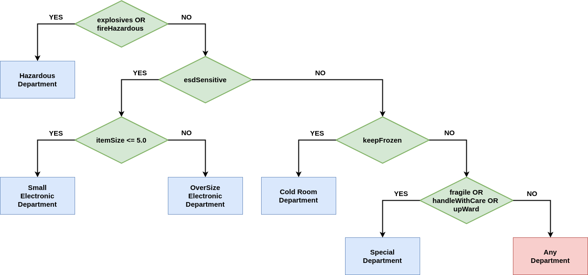

# Warning

This time there will be no detailed description of the steps to be followed to implement the solution.
Only an API that defines the interface of each of the required classes is provided.
We leave the way of implementation to you.

# GOAL: All tests are green!

**Do NOT modify any file in Warehouse/include/Interfaces**

# Products

Look at Warehouse/include/Products/ProductsList.hpp

Write classes:

- IndustrialServerRack
- GlassWare
- ExplosiveBarrel
- ElectronicParts
- AstronautsIceCream
- AcetoneBarrel
- TV

Each class should inherit from **IProduct**.
The constructor of each class should take **const std::string &name** and **const float size** as arguments.

ProductDescriptionJson string structure should look like this:

```
{
    "class": "TV",
    "name": "Samsung Viso",
    "size": 20.0,
    "flags": [
        "keepDry",
        "esdSensitive"
    ]
}
```

See *Warehouse/include/Interfaces/IProduct.hpp* to learn more about what methods should be overridden.

### TestProducts at this point should work

# Products Factory

Write class ProductFactory. This class should have the createProduct method:

```
warehouseInterface::IProductPtr createProduct(const std::string &className, const std::string &name, const float size) const
```

This method should realize factory pattern - create of Product based on provided arguments

### TestProductFactory at this point should work

# Departments

Look at *Warehouse/include/Departments/DepartmentsList.hpp*

There should be three types of departments:

- **Free Access Department** - it is the department that allows you to add/get items without any restrictions related to the order of elements.
- **FIFO Access Department** - it is the department that allows you to add/get items with restrictions related to the order of elements. The element which was first added to the department should be also get as the first element. It means that this department behaves as a FIFO (first in first out) queue.
- LIFO Access Department - it is the department that allows you to add/get items with restrictions related to the order of elements. The element which was added as the last element to the department should be getting as the first element. It means that this department behaves as a LIFO (last in, first out) queue.

Write classes:

- ColdRoomDepartment **(Free Access Department)**
- SmallElectronicDepartment **(Free Access Department)** - the only department with restrictions related to stored item size.
- OverSizeElectronicDepartment **(Free Access Department)**
- HazardousDepartment **(FIFO Access Department)**
- SpecialDepartment **(LIFO Access Department)**

Each class should inherit from IDepartment.
The constructor of each class should take **float maxOccupancy** as argument.

DepartmentStateJson string structure should look like this:

```
{
    "class": "ColdRoomDepartment",
    "items": [
        {
            "class": "AstronautsIceCream",
            "flags": [
                "keepDry",
                "keepFrozen"
            ],
            "name": "Vanilla",
            "size": 0.5
        },
        {
            "class": "AstronautsIceCream",
            "flags": [
                "keepDry",
                "keepFrozen"
            ],
            "name": "Chocolate",
            "size": 1.5
        }
    ],
    "maxOccupancy": 20,
    "occupancy": 2
}
```

# Warehouse

Look at *Warehouse/include/Interfaces/IWarehouse.hpp*
The warehouse is the class that manages many departments in the meaning of handling product deliveries and handling orders.
Implement Warehouse class which inherits from **IWarehouse**.

### The way of products allocation in departments



### Warehouse JSON definitions

OccupancyReportJson string structure should look like this:

```
{
    "departmentsOccupancy": [
        {
            "departmentName": "SpecialDepartment",
            "maxOccupancy": 1000,
            "occupancy": 40.5
        },
        {
            "departmentName": "ColdRoomDepartment",
            "maxOccupancy": 1000,
            "occupancy": 2
        },
        {
            "departmentName": "HazardousDepartment",
            "maxOccupancy": 1000,
            "occupancy": 150
        },
        {
            "departmentName": "SmallElectronicDepartment",
            "maxOccupancy": 1000,
            "occupancy": 0.5
        },
        {
            "departmentName": "OverSizeElectronicDepartment",
            "maxOccupancy": 1000,
            "occupancy": 6
        }
    ]
}
```

DeliveryReportJson string structure should look like this:

```
{
    "deliveryReport": [
        {
            "assignedDepartment": "SmallElectronicDepartment",
            "errorLog": "",
            "productName": "MacBook Pro",
            "status": "Success"
        },
        {
            "assignedDepartment": "None",
            "errorLog": "Warehouse cannot store this product. Lack of space in departments.",
            "productName": "Dell XPS",
            "status": "Fail"
        },
        {
            "assignedDepartment": "None",
            "errorLog": "Warehouse cannot store this product. Lack of required department.",
            "productName": "Explosive Barrel",
            "status": "Fail"
        }
    ]
}
```

OrderJson string structure should look like this:

```
{
    "order": [
        {
            "class": "IndustrialServerRack"
        },
        {
            "name": "Glass Plate"
        },
        {
            "class": "ElectronicParts",
            "name": "Transistor"
        }
    ]
}
```

WarehouseStateJson string structure should look like this:

```
{
    "warehouseState": [
        {
            "class": "SpecialDepartment",
            "items": [
                {
                    "class": "GlassWare",
                    "flags": [
                        "fragile",
                        "upWard"
                    ],
                    "name": "Glass Plate",
                    "size": 0.5
                },
                {
                    "class": "TV",
                    "flags": [
                        "fragile",
                        "keepDry"
                    ],
                    "name": "Brave",
                    "size": 40
                }
            ],
            "maxOccupancy": 1000,
            "occupancy": 40.5
        },
        {
            "class": "HazardousDepartment",
            "items": [
                {
                    "class": "AcetoneBarrel",
                    "flags": [
                        "fireHazardous",
                        "esdSensitive"
                    ],
                    "name": "1 gal",
                    "size": 50
                },
                {
                    "class": "ExplosiveBarrel",
                    "flags": [
                        "explosives",
                        "handleWithCare"
                    ],
                    "name": "100l",
                    "size": 100
                }
            ],
            "maxOccupancy": 1000,
            "occupancy": 150
        },
        {
            "class": "OverSizeElectronicDepartment",
            "items": [
                {
                    "class": "ElectronicParts",
                    "flags": [
                        "keepDry",
                        "esdSensitive"
                    ],
                    "name": "STM",
                    "size": 6
                }
            ],
            "maxOccupancy": 1000,
            "occupancy": 6
        }
    ]
}
```
